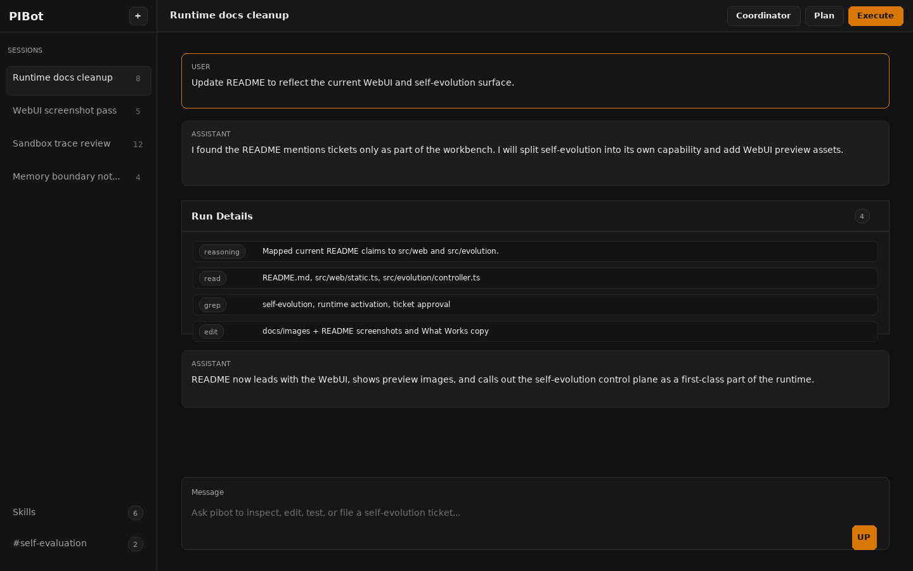
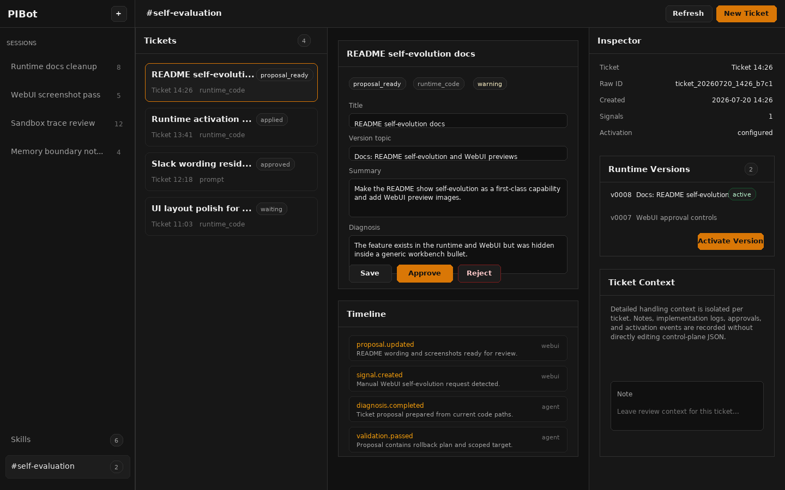

# pibot

pibot is a local-first coding-agent runtime for real repository work. It brings
an OpenAI-compatible model client together with workspace tools, persistent
memory, reusable Skills, Plan/Coordinator/Reflection workflows, Slack and WebUI
entry points, a WebUI self-evolution control plane, and Linux-native or Docker
command sandboxes.

The fastest local entry point is the WebUI:

```bash
npm run webui
```

Open `http://127.0.0.1:8787`.

## Screenshots





## What Works

- **WebUI workbench**: streamed conversations, file uploads, session storage,
  Skills browsing, run-mode controls, and per-session repo binding.
- **Self-evolution control plane**: WebUI-created tickets, isolated ticket
  context, proposal editing, approval/rejection, implementation runs,
  self-instruction and runtime-code versions, runtime activation, and audit
  history.
- **Slack agent**: app mentions and DMs, in-flight steering, queued follow-ups,
  Slack approvals, attachment download/upload, and long-task status updates.
- **Coding tools**: read, grep, LSP, bash, edit/write, repo
  checks, and generated file attachment.
- **Controlled memory**: global memory summaries, detailed topics,
  rollout summaries, extension notes, and append-only audit logs.
- **Skills**: workspace Skills plus pibot-wide Skills loaded only
  when the current task matches them.
- **Agent workflows**: Execute, Plan, Coordinator, optional Reflection, and
  tmux-backed child agents with isolated run artifacts.
- **Sandboxing and traces**: Linux-native sandbox by default, optional Docker
  sandbox, structured trace logs, and usage records.

## Quick Start

Install dependencies and create a local environment file:

```bash
npm ci
cp .env.example .env
```

Edit `.env` with at least your model provider settings:

```bash
OPENAI_API_KEY=...
OPENAI_BASE_URL=...
OPENAI_MODEL=...
```

Load the environment and start the WebUI:

```bash
set -a
. ./.env
set +a
npm run webui
```

`npm run webui` builds the TypeScript project and native sandbox launcher, then
starts `dist/web-main.js` under a small terminal supervisor. When a runtime-code
self-evolution change is activated from the WebUI, the same terminal rebuilds
and restarts the server.

## Slack Runtime

Slack is still a supported entry point. Configure a Slack app with Socket Mode,
set `SLACK_APP_TOKEN`, `SLACK_BOT_TOKEN`, and the model variables in `.env`,
then run:

```bash
npm start
```

The Slack app needs `app_mentions:read`, `chat:write`, `files:read`,
`files:write`, `im:history`, and `reactions:write`. Startup history backfill may
also need channel history/read scopes for the channel types you enable.

## Key Commands

```bash
npm run webui             # local WebUI + API
npm start                 # Slack runtime, with optional WebUI when enabled
npm run typecheck         # TypeScript type check
npm test                  # build, production checks, acceptance scripts
npm run validate:skills   # validate Skill packages
npm run build:native      # rebuild the Linux sandbox launcher
```

## Workspace

By default, pibot stores local runtime state under `.pibot/` in the workspace:

- `webui/conversations.json`: WebUI conversation index
- `channels/webui/<session-id>/context.jsonl`: WebUI session history
- `channels/<team>/<channel>/context.jsonl`: Slack channel history
- `memories/`: global memory summary, index, topics, rollout summaries, notes,
  and audit log
- `skills/`: pibot-wide Skill packages
- `evolution/`: self-evolution tickets, signals, versions, and audit events
- `runs/`: child-agent and long-run artifacts
- `trace.jsonl` and `usage.jsonl`: runtime traces and model usage

WebUI sessions do not inherit the global `.pibot/repo.json`. To let one session
edit a real repo, create
`.pibot/channels/webui/<session-id>/repo.json` with the target `repoPath`.

## Runtime Shape

```text
WebUI / Slack
  -> session and context storage
  -> AgentLoop
  -> OpenAI-compatible provider
  -> ToolRegistry and approval hooks
  -> workspace tools, sandbox, memory, Skills, and child agents
```
